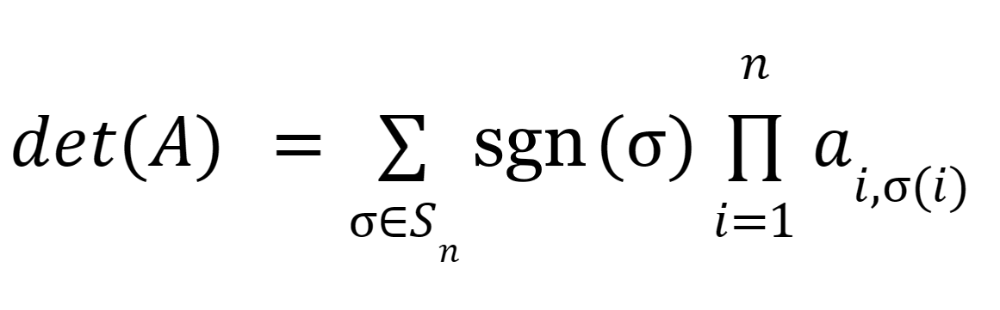
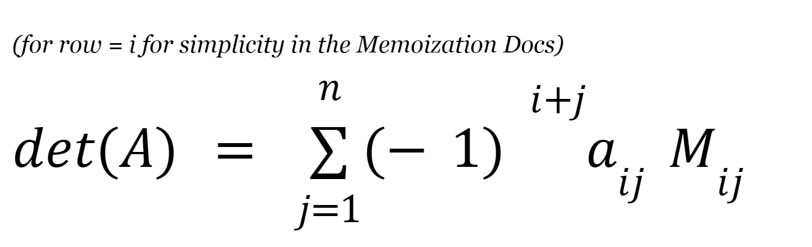

<div align="center">
    
    <br />
</div>

<h2>Memoize</h2>
Memoize provides a wrapping tool for developers to cache and output computed results for expensive
functions with exposed options and choices for developers.

Memoize is inspired off the TypeScript NPM package Memoize.

<h2>What are expensive functions?</h2>
An expensive function is one which demands high processing resources such as CPU usage, and is usually found in
large mathematical calculations, or deep recursion. It is vital that developers are aware of the 'cost' of their
functions when utilising it in code.

**An example of a cheap, non-expensive function**

```lua
local function fiveTimesTwo(): number
    return 5 * 2
end

-- O(1) notation
```

This is considered a **cheap** function as we have:

- Fixed inputs\*.
- Working with small, practical numbers far under any straining values.
- Performing a simple, arithmetic mathematical function.

_\*fixed inputs itself does not confirm a cheap function, however in our case we can confirm the function is cheap because our fixed inputs are small integers._

**An example of an expensive function**

```lua
local function ackermann(m, n)
    if m == 0 then
        return n + 1
    elseif n == 0 then
        return ackermann(m - 1, 1)
    else
        return ackermann(m - 1, ackermann(m, n - 1))
    end
end

-- Θ(A(m, n)) - Big-Theta notation which describes the asymptotic tight bound of function A(m, n)
```

This is considered an **expensive** function as:

- There is an explosive recursion which is notorious with the Ackermann function.

_Important note_

- This is an **extremely expensive function, and is a hyperbole of what an expensive function is**.

<h2>When should I memoize?</h2>
Memoization might sound like a bandaid solution to a lot of functions you have in your project, and can be quite tempting to use for things that might not exactly need memoization. It's important to memoize with care, as you could actually incur more performance-related issues using it, than without.

**Tips**
If your function takes the same inputs then its generally good to memoize, like calculating the start position and end position of a moving door which root position doesn't change, and is not influenced by physics- then you would likely consider memoizing.

An example of deciding whether to Memoize or not is shown in the difference between the **Leibniz determinant formula** and the **recursive Laplace expansion**, both used for calculating the determinant of a matrix.

**Leibniz**

<div align="left">
    
</div>
The Leibniz formula is *not ideal* for memoization, as a naive method we are working with a generally inefficient formula. We express the determinant as a sum over all n! permutations of the matrix elements. Each of the n! terms is unique, meaning memoization is actually adding more cost as we are not gaining any recomputations of the same inputs.

**Recursive Laplace Expansion**

<div align="left">
    
</div>
The recursive Laplace expansion **is ideal** for memoization, as we calculate the determinant of an `n * n` matrix by reducing it to a sum of determinants of minors. This leads to many repeated calculations of the determinants of the same minors, so we are recomputing the same inputs many times.

<h2>Getting Started</h2>
Memoize can be installed using Wally or by the raw source release.

Get started by adding this to your `wally.toml`

```toml
memoize = "djuntu/memoize@0.1.0"
```

Then install using `wally install`.

```console
you@bash:~$ sudo wally install
```

Memoize provides a simple API that allows developers exclusive freedoms over interaction, this is
an example of a simple memoized function and its intended outputs.

```lua
local memoize = require(path.to.memoize)

-- This function doesn't perform a specific mathematical function, rather acts
-- as an 'expensive' function.
local function myExpensiveFunction(a: number, b: number): number
    print("doing a calculation...")
    return (a*b)^(b^2)
end

local memoizedFunction = memoize.memoize(myExpensiveFunction)

print(memoizedFunction(2, 4))
-- output: doing a calculation...
-- output: 281474976710656
print(memoizedFunction(2, 4))
-- output: 281474976710656
print(memoizedFunction(2, 4))
-- output: 281474976710656
```

What if I want to discard a memoized value and recalculate it at another time?

- Memoize provides a `maxAge` option when memoizing a function, giving you scheduled
  control over your memoization cache, where `{ maxAge = n miliseconds }`.

```lua
local memoizedFunction = memoize.memoize(myExpensiveFunction, { maxAge = 10000 }) -- expressed in miliseconds! (10 seconds)

print(memoizedFunction(2, 4))
-- output: doing a calculation...
-- output: 281474976710656

task.wait(5) -- 5 seconds elapsed
print(memoizedFunction(2, 4))
-- output: 281474976710656

task.wait(6) -- 11 seconds elapsed
print(memoizedFunction(2, 4))
-- output: doing a calculation...
-- output: 281474976710656
```

But what if I don't want a timer, and instead am relying on a signal, or another function and the expiration time is unknown?

- Memoize provides a neat function where you can clear all timers and cache.

```lua
local memoizedFunction = memoize.memoize(myExpensiveFunction)

print(memoizedFunction(2, 4))
-- output: doing a calculation...
-- output: 281474976710656
print(memoizedFunction(2, 4))
-- output: 281474976710656

-- clear and rememoize function
memoize.memoizeClear(memoizedFunction)
memoizedFunction = memoize.memoize(memoizedFunction)

print(memoizedFunction(2, 4))
-- output: doing a calculation...
-- output: 281474976710656
print(memoizedFunction(2, 4))
-- output: 281474976710656
```

<h2>Classes and Memoization</h2>
Memoization with classes can seem daunting at first, but this package aims to simpify it as much as possible by using a **decorator-like approach**.

- Due to Roblox's runtime, we cannot put decorators above method, so Memoize advises you put them directly below the method.

```lua
local memoizeMethod = require([path.to.memoize].Method)
local myClass = {}
myClass.__index = myClass

function myClass.new()
    return setmetatable({ num = 0 }, myClass)
end

function myClass:add(n: number): number
    self.num += n
    return self.num
end
memoizeMethod()(myClass, 'add') -- decorate

---------------------------------------------

local object = myClass.new()

print(object:add(5)) -- 5
print(object:add(5)) -- 5
print(object:add(6)) -- 11
print(object:add(6)) -- 11
```
